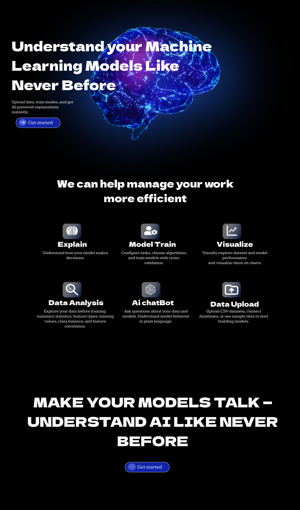
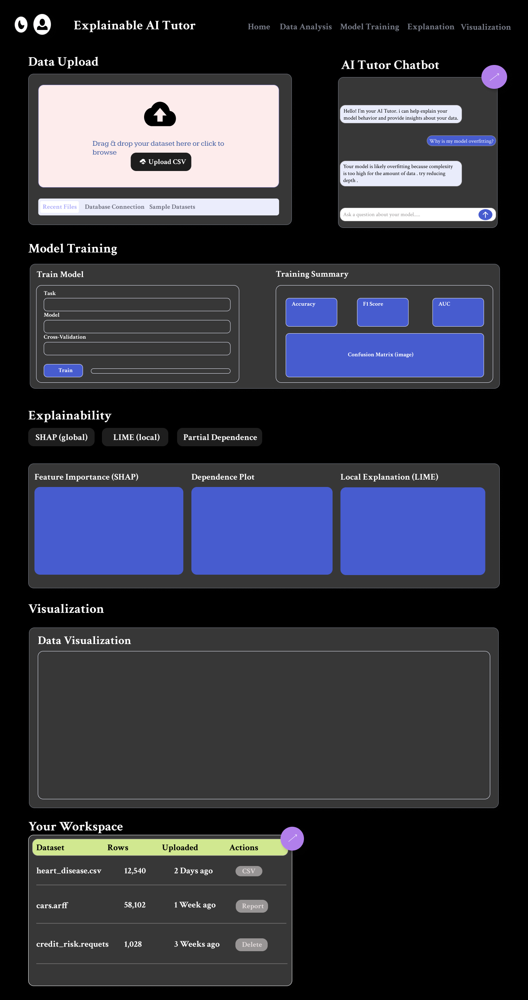
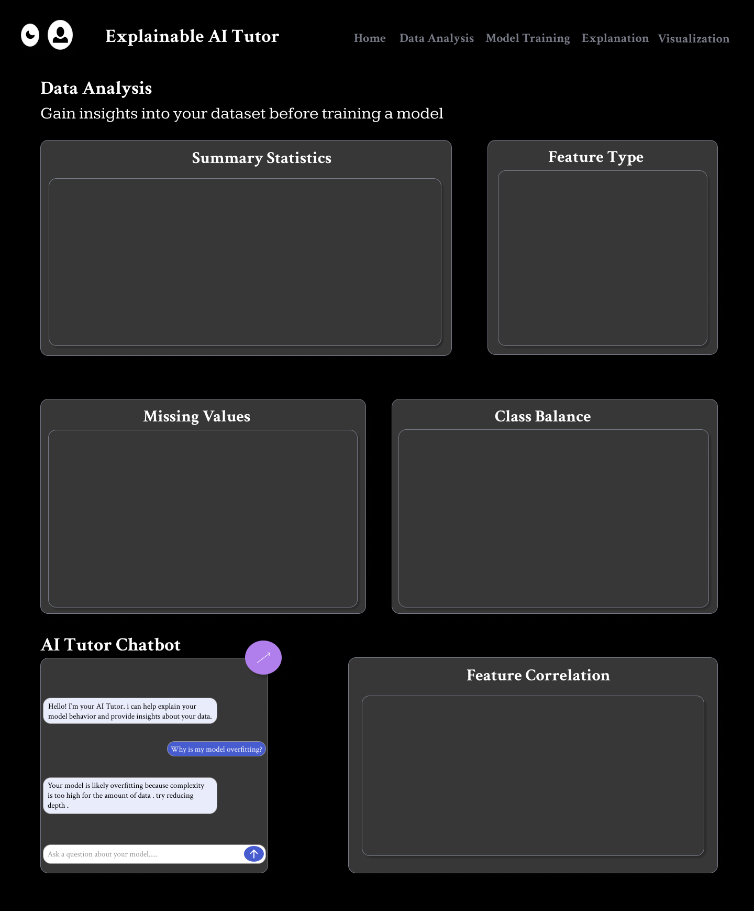
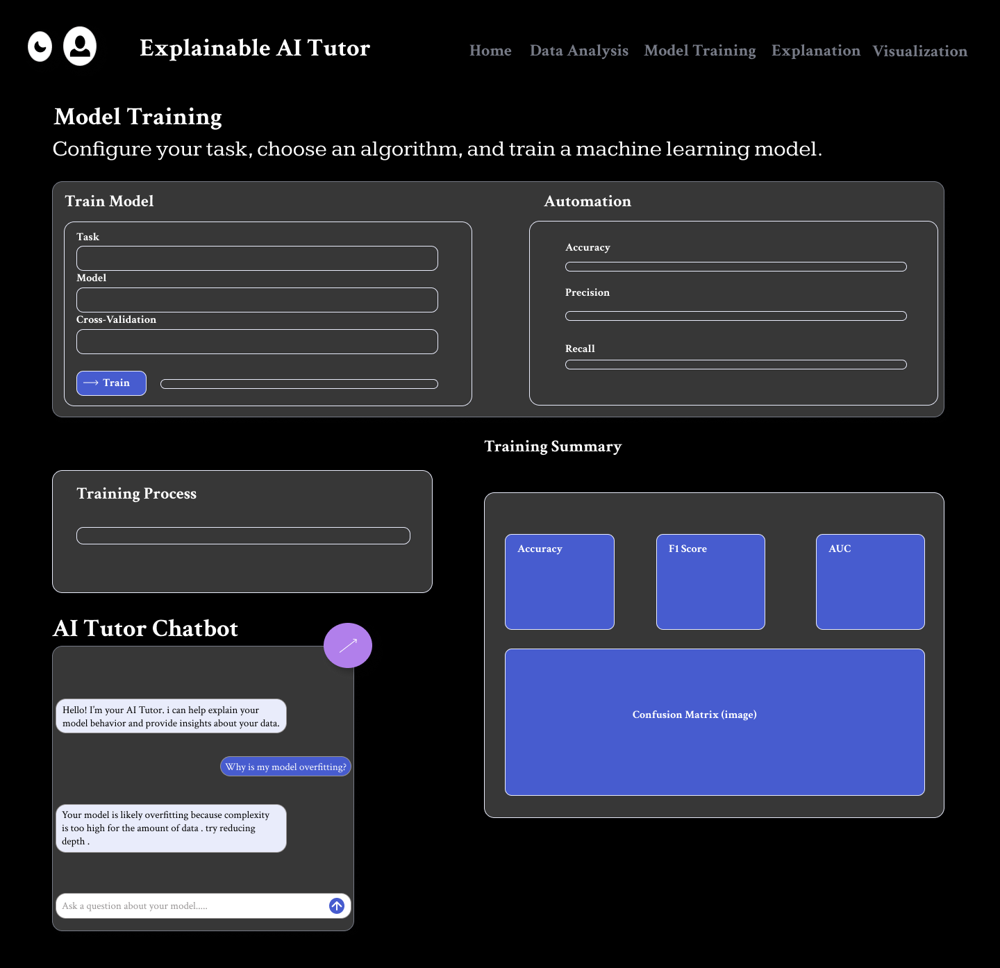
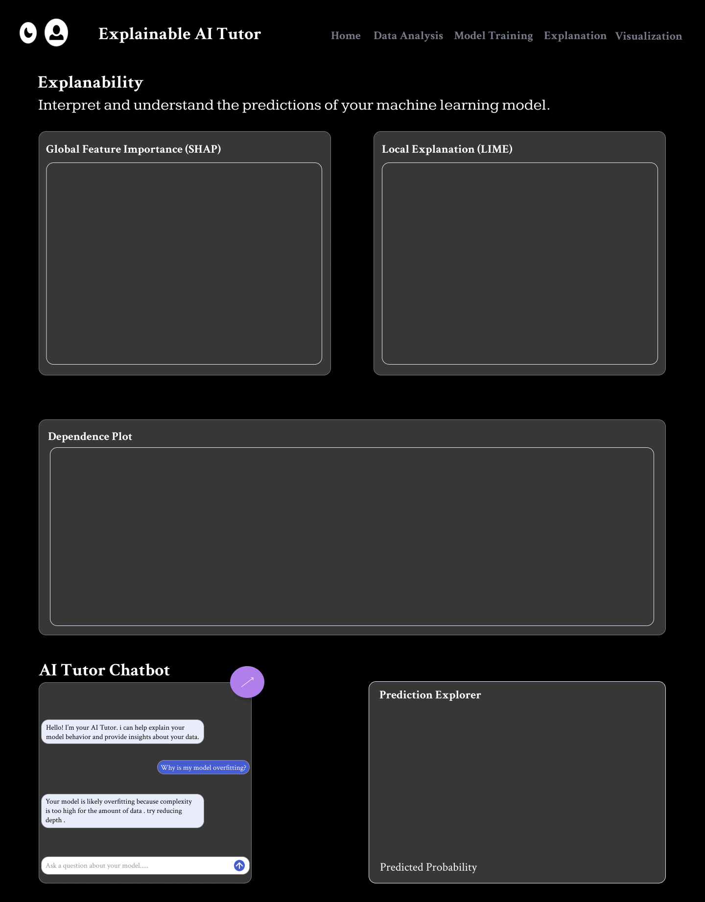
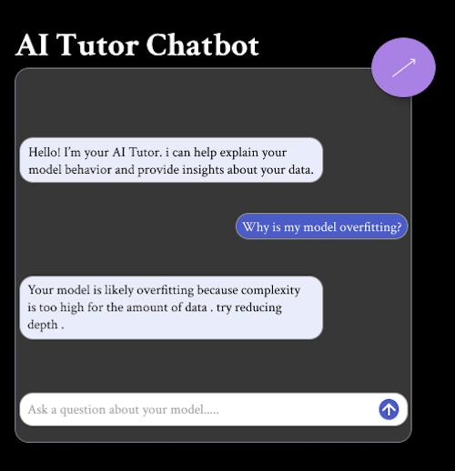

# Explainable AI Tutor

This project is an interactive Explainable AI tutor that helps students and data scientists understand:
- **Model behavior**
- **Overfitting and underfitting**
- **Feature importance** using SHAP, LIME, etc.
- **Real-time explanations**

## 🚀 Features
- End-to-end ML pipeline (classification, regression, clustering)
- Interactive visualizations
- Explainability with SHAP & LIME
- FastAPI backend + HTML/CSS/JS frontend

## 🛠️ Tech Stack
- Python, scikit-learn, SHAP, LIME
- FastAPI (backend)
- HTML/CSS/JavaScript (frontend)

## 🎨 Project UI

Here’s how the tutor looks:

### Home page


### 📂 Dataset Upload
Upload your CSV dataset and preview its first few rows.


### 📊 Data Visualization
Explore your dataset visually:
- Distribution plots (histograms)
- Correlation heatmaps
- Target distribution (for classification)
- Feature importance (after model training)


### ⚙️ Model Training
Choose Classification, Regression, or Clustering and train your model in one click. 


### 🔍 Explainable AI (SHAP + LIME)
Get visual explanations for model predictions to understand *why* your model made certain decisions.


### 💬 AI Tutor Chat
Interact with an LLM-based mentor:
- "Why is my accuracy low?"
- "Which features are most important?"
- "How can I improve my model?"



## 📦 Installation
```bash
git clone https://github.com/your-username/Explainable-AI-Tutor.git
cd Explainable-AI-Tutor
pip install -r requirements.txt
